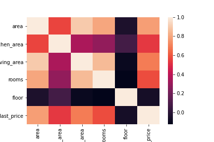

# E2E_Final_project

This task is the Final project for the course 22SM1 End-to-end Sample ML project

## Information about source data and some statistics

### Datasourse
For this task we were given a dataset from Yandex.Realty (https://realty.yandex.ru) that contains data on real estale for renting apartments in St. Petersburg and Leningrad Oblast from 2016 untill mid of August 2018. The dataset consists of prices, adresses, different characteristicts of apartment such as area, number of rooms etc.

Our goal is to create two models that will make accurate price predictions **only in Saint-Petersburg** on rental prices to help users make better dicisions on choosing apartments 

The data was cleaned from ouliers using interquantile range method

### Price vs Area


### Correlation matrix


|       | last_price | floor  | open_plan | rooms | area   | renovation | 
| :---- | ---------: | -----: | --------: | ----: | -----: | ---------: |
| count | 16974      | 16974  | 16974     | 16974 | 16974  | 16974      |
| mean  | 27440.64   | 6.83   | 0.00      | 1.47  | 48.28  | 2.72       |
| std   | 16280.60   | 5.14   | 0.00      | 0.82  | 20.20  | 4.24       |
| min   | 12000.00   | 1.00   | 0.00      | 0.00  | 11.00  | 0.00       |
| 25%   | 19000.00   | 3.00   | 0.00      | 1.00  | 35.11  | 0.00       |
| 50%   | 23000.00   | 5.00   | 0.00      | 1.00  | 42.00  | 0.00       |
| 75%   | 30000.00   | 9.00   | 0.00      | 2.00  | 55.00  | 3.00       |
| max   | 195000.00  | 33.00  | 0.00      | 5.00  | 200.00 | 11.00      |


Then separate data on train, validation, and holdout samples:

```python
train_df = rent_df_cleaned[(rent_df_cleaned.first_day_exposition >= '2018-01-01') 
                          & (rent_df_cleaned.first_day_exposition < '2018-04-01')]
test_df = rent_df_cleaned[(rent_df_cleaned.first_day_exposition >= '2018-04-01') 
                          & (rent_df_cleaned.first_day_exposition < '2018-06-01')]
holdout_df = rent_df_cleaned[rent_df_cleaned.first_day_exposition >= '2018-06-01']
```

Afterwards, we should create and apply StandardScalers

## Information about your model, choosen framework, hyperparams) 

For the model, we have chosen several variables that have strong relationship with price. 
We are going to build two models: **Catboost** and **Random Forest**, and will use the factors each:
* Floor number -- int
* Area -- float
* Number of rooms -- int
* Open plan -- int
* Renovation -- int

| Type of model         | MAE                 | MSE                 | RMSE               |
| :-------------------- | ------------------: | ------------------: | -----------------: |
| CatBoostRegressor     | 0.3445718651415547  | 0.38229932956889845 | 0.618303590131012  |
| RandomForestRegressor | 0.3443413366929827  | 0.3756055773387197  | 0.6128666880641497 |
| DecisionTreeRegressor | 0.35584971594979425 | 0.3983763859261638  | 0.6311706472311303 |

```
catboost_model = CatBoostRegressor(iterations=1000, depth=7, learning_rate=0.03, logging_level='Silent', thread_count=10, random_seed=27)

random_forest_model = RandomForestRegressor(n_estimators=100, bootstrap=0.8, max_depth=10,min_samples_split=2, min_samples_leaf=3, max_features=1, random_state=0)

DecisionTree_model = DecisionTreeRegressor(max_depth=6, min_samples_split=10, random_state=0)
```

**NOTE** GridSearch was used to find the best parameters

## How to install instructions and run your app with virtual environment

First of all we need to enable virtual machine and create virtual environment using these commands:

1. `sudo apt install python3.8-venv`
     
2. `python3 -m venv env`
 
3. `source env/bin/activate`

Then install all required packages and finally run our python script:

1. `pip3 install -r requirements.txt`
 
2. `python app.py`

## Information about Dockerfile

To use docker you need to follow these instructions:

* [Installation methods](https://docs.docker.com/engine/install/ubuntu/)
  
* [Post-installation steps for Linux](https://docs.docker.com/engine/install/linux-postinstall/)

## How to open the port in your remote VM

For our task 5444 port was used, so you neeed to 

`sudo ufw allow 5444`

Then to make request online you need to go on [Postman](https://www.postman.com/),  

`XX.XXX.XXX.XX:5444/predict_price?model_version=1&floor=3&open_plan=0&rooms=3&area=68&renovation=1`

whrerein, `XX.XXX.XXX.XX` - your VM public IP address

**NOTE**
Request should contain all the parameters or you will get an exception: ex.500 Internal server error

* Model_version (1 for CatBoost_model, 2 for Random_Forest_model)
* Open_plan (0 or 1)
* Area 
* Floor
* Rooms
* renovation 

## How to run app using docker and which port it uses

Here is a link for my [Docker](https://docs.docker.com/engine/install/ubuntu/). It uses port 5444.

1. `docker pull barcelona12345/gsom_predictor2:v.0.4`
2. `docker run --network host -it barcelona12345/gsom_predictor2:v.0.4 /bin/bash`
3. `python3 app.py`
